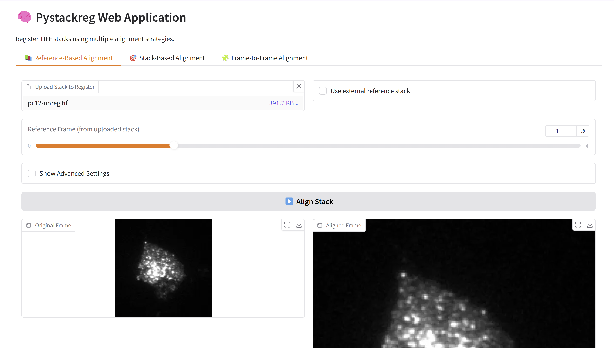

# 🧠 Stack Image Registration Web App  
A web-based application for image stack registration powered by **Gradio** and **pystackreg**.  
This tool allows users to align and stabilize multi-frame TIFF images using a variety of transformation models.

<p align="center">
    
</p>

---

## 🚀 Try the App  
The application is running on [Hugging Face](https://huggingface.co/), try it using this [link](https://huggingface.co/spaces/qchapp/pystackreg-app)!

---

## 🛠️ Installation  
We recommend performing the installation in a clean Python environment.

This app requires `python>=3.10`. To install dependencies, run:

```sh
pip install -r requirements.txt
```

---

## ▶️ Usage  
To run the app locally:

```sh
python app.py
```

Then open your browser and go to: [http://localhost:7860](http://localhost:7860)

---

## 🔍 About Stack Registration  
This app uses the [pystackreg](https://github.com/glichtner/pystackreg) library, a Python port of the TurboReg/StackReg algorithms.  
It supports several transformation models for alignment:
- Translation
- Rigid Body
- Scaled Rotation
- Affine
- Bilinear

---

## 📂 Features  
This application provides three core registration modes:

1. **📚 Reference-Based Alignment**  
   Align all frames within a stack to a selected reference frame — either from the same stack or an external 3D image.

2. **🎯 Stack-Based Alignment**  
   Align every frame in one stack to the first frame of another reference stack.

3. **🧩 Frame-to-Frame Alignment**  
   Align a single frame to another frame within the same stack.

By default, the app uses the **Rigid Body** transformation mode for all alignment tasks.  
If needed, users can enable **Advanced Settings** in each tab to select from other transformation models, such as Translation, Affine, or Bilinear.

Each mode offers:
- 🔍 Interactive image preview
- 🧭 Frame-by-frame navigation
- 💾 Downloadable aligned results
- ⚙️ Customizable transformation models via advanced options

---

### 📂 Examples in the App

You can try the application directly using preloaded examples from the [`pystackreg`](https://github.com/glichtner/pystackreg) repository.  
Each mode includes interactive buttons that load demo TIFF stacks automatically:

- 📚 **Reference-Based Alignment**:  
  Loads a stack of PC12 microscopy frames.

- 🎯 **Stack-Based Alignment**:  
  Loads both an unregistered and a translation-aligned stack.

- 🧩 **Frame-to-Frame Alignment**:  
  Uses the same unregistered stack for aligning specific frames.

No need to upload your own files — just click and experiment!

---

### 🌐 URL Parameter Support

The app supports loading image stacks from external URLs using query parameters.

**▶️ Load a single stack (for Reference-Based or Frame-to-Frame):**

```
https://huggingface.co/spaces/qchapp/pystackreg-app?file_url=https://github.com/glichtner/pystackreg/raw/master/examples/data/pc12-unreg.tif
```


**▶️ Load two stacks (for Stack-Based Alignment):**

```
https://huggingface.co/spaces/qchapp/pystackreg-app?file_url_1=https://github.com/glichtner/pystackreg/raw/master/examples/data/pc12-unreg.tif&file_url_2=https://github.com/glichtner/pystackreg/raw/master/examples/data/pc12-reg-translation.tif
```

> 💡 The app will automatically load and preview the provided stack(s) in the appropriate tabs.

---

### 📚 Credits

- **App Author**: [Quentin Chappuis](https://github.com/qchapp)  
  Developed the Gradio-based web interface and integrated `pystackreg` for image stack registration.

- **Core Registration Library**: [pystackreg](https://github.com/glichtner/pystackreg)  
  A Python port of the StackReg plugin, written by [Gregor Lichtenberg](https://github.com/glichtner).

- **Original Algorithm Author**: Philippe Thévenaz (EPFL)  
  The core algorithm was originally developed by Philippe Thévenaz and is described in the following publication:

  > P. Thévenaz, U.E. Ruttimann, M. Unser.  
  > *A Pyramid Approach to Subpixel Registration Based on Intensity*.  
  > IEEE Transactions on Image Processing, vol. 7, no. 1, pp. 27–41, January 1998.  
  > [View paper](http://bigwww.epfl.ch/publications/thevenaz9801.html)

  For more information, visit the [Biomedical Imaging Group at EPFL](http://bigwww.epfl.ch/).

---